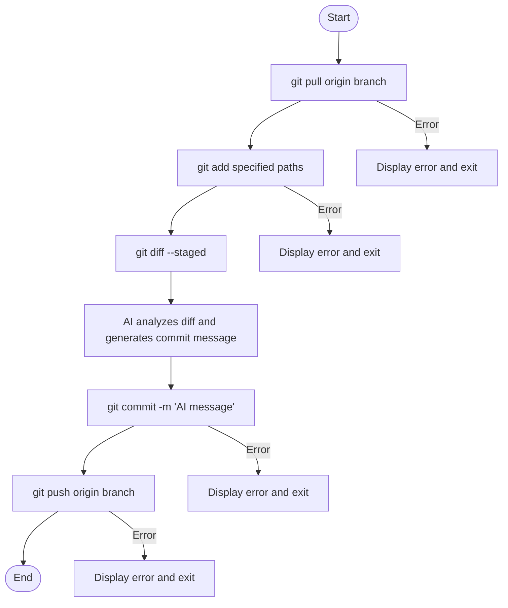

# What's gitacp
"acp" stands for add, commit, push which are the repetitive flow you do in handling projects in GitHub. Doing them respectively is crucial if you belong to team projects but not necessary for private projects. From my standpoint, I mostly use git for technical blogging, PoCs, personal developments that don't require a strict management.

To be able to automate the flow, I integrated AI for generating concise commit messages with diff. 

The overall flow is below.


# Requirements
## export Environmental Variables
This tool reads the environment variables set in your client. So please declare them in advance.

```bash
$ export OPENAI_API_KEY="xxxxxxxxxxxxxxxxxxxxxxxxxxxxxxxxxxxxxxxxxxxxxxxxxx"
$ export BASE_URL="https://xxxxxxxxxx.openai.azure.com/openai/v1/"
$ export MODEL_NAME="gpt-x.x"
```


## import Azure Open AI module
```bash
$ go get github.com/openai/openai-go/v3
```

# notes
This tool is supposed to be used with personal repositories. If you apply this tool to shared ones, some conflicts may happen. Please solve the conflict manually if that is the case.